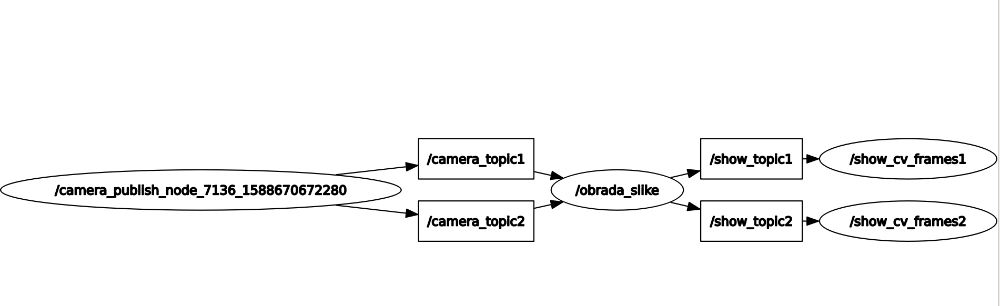

# paket image_features

Paket je napravljen za suradnju s paketom rpi-ivport-dual-v2, koji treba biti pokrenut na računalu  Raspberry Pi.

Skripte su pisane u jeziku Python2.7
Node `/obrada_slike` se pretplaćuje na 2 topica s porukama tipa `Image` koji odgovaju frameovima s kamera spojenih preko multipleksora na Rpi pločicu.
Slike se obraduju bibliotekom OpenCv i prikazuju u stvarnom vremenu.

Rqt graf :



Pretpostavlja se da, je omogućena komunikacija laptopa i Rpi-ja koristeci protokol `ssh`. `roscore` je potrebno pokrenuti na Raspberry Pi računalu:
```
 ssh ivona rpi@192.168.21.114   
 roscore
```
Na laptopu je potrebno podesiti `ROS_MASTER_URI` i `ROS_HOSTNAME` kako bi se ostvarilo ROS okruženje s jednim roscore-om na 2 uređaja:
```
 export ROS_MASTER_URI=http://rpi:11311/ && export ROS_IP=ivan-Inspiron-5770.local && export ROS_HOSTNAME=ivan-Inspiron-5770.local

```
### Skidanje paketa
```
mkdir ~/your_ws/src
cd ~/your_ws
catkin init
cd src
git clone https://github.com/IvonaKr/image_features
cd ..
catkin build
```

### Pokretanje paketa

```
roslaunch image_features obrada_i_prikaz_slike.launch
```
